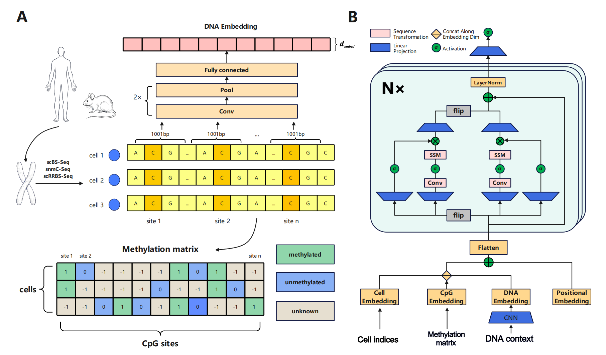

# MambaCpG

## Construction process of methylation matrix and structure of MambaCpG



## Installation
We recommend adhering to the following instructions for local deployment and leveraging GPU resources for model training:

```bash
git clone https://github.com/Lee-qiangzee/MambaCpG.git
cd MambaCpG
conda create --name MambaCpG python=3.10
source activate MambaCpG
```
Then manually download the following two libraries, upload them to the project, and install them using `pip install` with the file paths.

[mamba-ssm](https://github.com/state-spaces/mamba/releases/download/v1.2.0.post1/mamba_ssm-1.2.0.post1+cu118torch2.0cxx11abiFALSE-cp310-cp310-linux_x86_64.whl)

[causal-conv1d](https://github.com/Dao-AILab/causal-conv1d/releases/download/v1.2.0.post2/causal_conv1d-1.2.0.post2+cu118torch2.0cxx11abiFALSE-cp310-cp310-linux_x86_64.whl)

Finally:
```bash
pip install -r requirements.txt
```

## Usage
```bash
# train a model
python trainmodel.py X.npz y.npz pos.npz
# impute your dataset
python impute.py X.npz y.npz pos.npz output
```

## Citation

## Acknowledgement
DeepCpG[(Paper)](https://genomebiology.biomedcentral.com/articles/10.1186/s13059-017-1189-z)[(Code)](https://github.com/cangermueller/deepcpg)

CpG Transformer[(Paper)](https://academic.oup.com/bioinformatics/article/38/3/597/6413629?)[(Code)](https://github.com/gdewael/cpg-transformer)

GraphCpG[(Paper)](https://academic.oup.com/bioinformatics/advance-article/doi/10.1093/bioinformatics/btad533/7255916?)[(Code)](https://github.com/yuzhong-deng/graphcpg)
